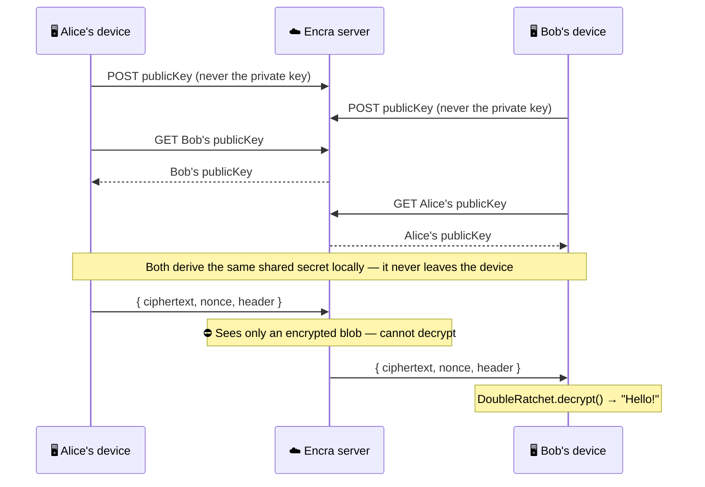

<h1 align="center">
  <br>
  <a href="https://encra.dev">Encra</a>
  <br>
</h1>

<h3 align="center">Signal-level end-to-end encryption for any app.</h3>

<p align="center">
  One API key. One hook. Your users' data is encrypted on their device before it ever leaves.
  <br>
  Your server never sees plaintext — <em>mathematically guaranteed</em>.
</p>

<p align="center">
  <a href="https://www.npmjs.com/package/@encra/core"></a>
  <a href="https://www.npmjs.com/package/@encra/react"></a>
  <a href="https://www.npmjs.com/package/@encra/client"></a>
  <a href="https://www.npmjs.com/package/encra"></a>
  <br>
  <a href="https://github.com/adityayaduvanshi/encra/blob/master/LICENSE"></a>
  <a href="https://encra.dev/docs"></a>
</p>

<p align="center">
  <a href="https://encra.dev"><strong>Live demo & API keys → encra.dev</strong></a>
</p>

---

## At a glance

```tsx
// React — E2E encrypted chat in 10 lines
import { useE2EChat } from '@encra/react'

function Chat({ me, recipient }) {
  const { messages, isReady, sendMessage } = useE2EChat({
    apiKey: process.env.NEXT_PUBLIC_ENCRA_API_KEY,
    userId: me,
  })

  return (
    <>
      {messages.map((m, i) => <p key={i}><b>{m.from}:</b> {m.text}</p>)}
      <button disabled={!isReady} onClick={() => sendMessage(recipient, 'Hello!')}>
        Send encrypted message
      </button>
    </>
  )
}
```

> Keys are generated **on the device**. The server stores only public keys and encrypted blobs. Even if the server is hacked, there is nothing readable to steal.

---

## Why Encra?

Most apps store user data in plaintext. One breach, one subpoena, one rogue employee — everything is exposed. Encra moves encryption to the client so your server becomes **mathematically incapable** of reading user data, not just policy-incapable.

- 🔒 **HIPAA / GDPR by default** — you can't leak what you can't read
- ⚡ **5-minute setup** — one hook or one class, no cryptography expertise needed
- 🔑 **Zero key management** — key generation, exchange, rotation, and persistence handled for you
- 📱 **Multi-device ready** — each browser/device gets its own key pair; messages are encrypted once per device automatically
- 🛡️ **Built on libsodium** — the same crypto library used by Signal, WhatsApp, and 1Password

**The alternative is months of work:**

| | Raw Web Crypto | Build your own | **Encra** |
|---|---|---|---|
| Setup time | Days | Months | **5 minutes** |
| Key server + relay | Build it | Build it | **Included** |
| Double Ratchet | Build it | Build it | **Included** |
| State persistence | Build it | Build it | **Included** |
| Reconnect + backoff | Build it | Build it | **Included** |
| Cryptographic test vectors | Write them | Write them | **Included** |
| Ongoing maintenance | You | You | **Encra team** |

---

## How it works

Your server is a blind relay. It stores public keys and forwards encrypted blobs — it has no ability to read the content.



Every message uses a **unique one-time key** derived from a ratchet chain. Keys are deleted immediately after use — compromising today's key reveals nothing about past or future messages.

---

## What can you encrypt?

| Use case | React | Vanilla / Vue / Svelte / Node |
|---|---|---|
| Real-time chat | `useE2EChat()` | `EncraClient.sendMessage()` |
| Files & media (≤50 MB) | `useE2EFile()` | `EncraClient.encryptFile()` |
| Form submissions | `useE2EForm()` | `EncraClient.encryptFields()` |
| Database columns | `encryptField()` from `@encra/core` | same |

---

## Packages

| Package | Description |
|---|---|
| [`@encra/core`](packages/core) | Pure crypto primitives — X25519, XSalsa20-Poly1305, Double Ratchet, BLAKE2b. Zero framework deps. |
| [`@encra/react`](packages/react) | React hooks — `useE2EChat`, `useE2EFile`, `useE2EForm`. |
| [`@encra/client`](packages/client) | Framework-agnostic `EncraClient` — Vue, Svelte, Angular, vanilla JS, Node.js. |
| [`@encra/server`](packages/server) | Self-hostable key server + WebSocket relay (BUSL 1.1). |
| [`encra`](packages/cli) | CLI — `npx encra init`, `keygen`, `ping`. |

---

## Quickstart

### 1. Get an API key

Sign up at [encra.dev](https://encra.dev) — free plan, no credit card required.

```bash
# Or scaffold everything interactively:
npx encra init
```

### 2. Install

```bash
# React
npm install @encra/react

# Vue · Svelte · Angular · vanilla JS · Node.js
npm install @encra/client

# Low-level crypto only (no server, no WebSocket)
npm install @encra/core
```

---

## Usage examples

### Encrypted chat — React

```tsx
import { useE2EChat } from '@encra/react'

function ChatRoom({ userId, recipientId }) {
  const { messages, isReady, isConnecting, sendMessage, error } = useE2EChat({
    apiKey:   process.env.NEXT_PUBLIC_ENCRA_API_KEY!,
    userId,
    onError:  (err) => console.error('Encra error:', err),
  })

  if (isConnecting) return <p>Connecting…</p>
  if (error)        return <p>Error: {error.message}</p>

  return (
    <div>
      <ul>
        {messages.map((m, i) => (
          <li key={i}><strong>{m.from}:</strong> {m.text}</li>
        ))}
      </ul>
      <button disabled={!isReady} onClick={() => sendMessage(recipientId, 'Hey!')}>
        Send
      </button>
    </div>
  )
}
```

### Encrypted chat — Vue

```ts
// composable: useEncraChat.ts
import { ref, onMounted, onUnmounted } from 'vue'
import { EncraClient } from '@encra/client'

export function useEncraChat(userId: string) {
  const messages = ref<{ from: string; text: string }[]>([])
  const isReady  = ref(false)
  const client   = new EncraClient({ apiKey: import.meta.env.VITE_ENCRA_KEY, userId })

  onMounted(async () => {
    client.on('message', () => { messages.value = [...client.messages] })
    client.on('ready',   () => { isReady.value  = true })
    await client.connect()
  })

  onUnmounted(() => client.disconnect())

  return { messages, isReady, sendMessage: client.sendMessage.bind(client) }
}
```

### Encrypted chat — Vanilla JS / Node.js

```ts
import { EncraClient } from '@encra/client'

const client = new EncraClient({
  apiKey:    process.env.ENCRA_API_KEY,
  userId:    'alice',
  serverUrl: 'https://api.encra.dev', // optional — this is the default
})

client.on('ready',   ()    => console.log('🔒 Connected'))
client.on('message', (msg) => console.log(`${msg.from}: ${msg.text}`))
client.on('error',   (err) => console.error(err))

await client.connect()
await client.sendMessage('bob', 'Hello, Bob!')

client.disconnect()
```

### Encrypted file upload — React

```tsx
import { useE2EFile } from '@encra/react'

function FileShare({ userId, recipientId }) {
  const { encryptFile, isReady } = useE2EFile({
    apiKey: process.env.NEXT_PUBLIC_ENCRA_API_KEY!,
    userId,
  })

  async function handleUpload(e: React.ChangeEvent<HTMLInputElement>) {
    const file = e.target.files?.[0]
    if (!file) return

    const encrypted = await encryptFile(file, recipientId)

    // Upload ciphertext however you like — S3, R2, your DB, etc.
    await fetch('/api/files', {
      method:  'POST',
      headers: { 'Content-Type': 'application/json' },
      body:    JSON.stringify(encrypted),
    })
  }

  return <input type="file" disabled={!isReady} onChange={handleUpload} />
}
```

### Encrypted form — React (HIPAA / GDPR)

```tsx
import { useE2EForm } from '@encra/react'

function MedicalForm({ patientId, doctorId }) {
  const { encryptFields, isReady } = useE2EForm({
    apiKey: process.env.NEXT_PUBLIC_ENCRA_API_KEY!,
    userId: patientId,
  })

  async function handleSubmit(e: React.FormEvent<HTMLFormElement>) {
    e.preventDefault()
    const data = Object.fromEntries(new FormData(e.currentTarget)) as Record<string, string>

    // Only the doctor can decrypt — your server stores ciphertext only
    const encrypted = await encryptFields(data, doctorId)

    await fetch('/api/intake', {
      method:  'POST',
      headers: { 'Content-Type': 'application/json' },
      body:    JSON.stringify(encrypted),
    })
  }

  return (
    <form onSubmit={handleSubmit}>
      <input name="ssn"            placeholder="SSN"           />
      <input name="dateOfBirth"    placeholder="Date of birth" />
      <input name="chiefComplaint" placeholder="Chief complaint"/>
      <button disabled={!isReady} type="submit">Submit (encrypted)</button>
    </form>
  )
}
```

### Database field encryption — no server needed

```ts
import { generateFieldKey, encryptField, decryptField } from '@encra/core'

// Generate once — store in AWS Secrets Manager, Vault, etc. Never in the DB.
const key = await generateFieldKey()

// Encrypt before INSERT
const encryptedSSN = await encryptField('123-45-6789', key)
// → { ciphertext: "base64...", nonce: "base64..." }

// Decrypt after SELECT
const ssn = await decryptField(encryptedSSN, key)
// → "123-45-6789"
```

---

## FAQ

### What problem does Encra solve?

Most apps store user data in plaintext on their servers. A single breach — or a subpoena — exposes everything. Encra moves encryption to the client so your server becomes mathematically incapable of reading user data, not just policy-incapable.

### Why not use raw Web Crypto?

You could. But you'd need to implement X25519 key exchange, Double Ratchet from scratch (forward secrecy, out-of-order messages, state persistence), a key server, a WebSocket relay, reconnection logic, offline delivery, and cryptographic test vectors. Encra is the production-grade version of that work — auditable and open source.

### How secure is it?

Encra uses the same cryptographic primitives as Signal:

| Purpose | Algorithm |
|---|---|
| Key exchange | X25519 (ECDH) via `crypto_box_beforenm` |
| Encryption | XSalsa20-Poly1305 (authenticated) |
| KDF / ratchet | Keyed BLAKE2b-256 |
| Randomness | OS CSPRNG via libsodium `randombytes_buf` |

### What platforms are supported?

React 18+, Vue 3, Svelte, Angular, vanilla JS (browser), Node.js 18+, and React Native (`@encra/core` only).

### How fast is setup?

Under 5 minutes: install the package, set your API key, drop in one hook or class. Or run `npx encra init` for an interactive wizard.

---

## Security model

### What we protect against

| Threat | How |
|---|---|
| Server breach | Server stores only public keys + ciphertext. No plaintext, no private keys. |
| Network interception | XSalsa20-Poly1305 authenticated encryption — tampering is detected and rejected. |
| Key compromise exposing past messages | Double Ratchet with per-message key deletion (forward secrecy). |
| Key compromise exposing future messages | DH ratchet step on every direction change (break-in recovery). |
| Weak randomness | All nonces and key pairs via libsodium `randombytes_buf` (OS CSPRNG). |

### What we do not protect against

- **Compromised endpoint** — if the device is fully compromised (malware, physical access), Encra cannot help.
- **Metadata** — Encra encrypts content, not metadata. The server knows *who* communicated and *when*, not *what*.
- **Key server impersonation** — use `generateFingerprint()` for out-of-band verification of peer identity.

### Double Ratchet — how forward secrecy works

```
Root Key
   │
   ├─► Chain Key 1 ──► Message Key 1  (used once, then deleted from memory)
   │       │
   │       └─► Chain Key 2 ──► Message Key 2  (used once, then deleted from memory)
   │
   └─► (DH ratchet step on direction flip — new root key, new chains)
```

If an attacker compromises today's key: past messages are safe (keys already deleted), future messages are safe after the next DH ratchet step.

---

## API Reference

### `@encra/react` — hooks

```typescript
// Encrypted real-time chat
const { messages, isReady, isConnecting, sendMessage, error } = useE2EChat({
  apiKey:         string,
  userId:         string,
  serverUrl?:     string,                       // default: https://api.encra.dev
  onError?:       (err: Error) => void,
  onWireMessage?: (event: WireEvent) => void,
})

// Encrypted file transfer (up to 50 MB)
const { encryptFile, decryptFile, isReady, error } = useE2EFile({
  apiKey:     string,
  userId:     string,
  serverUrl?: string,
  onError?:   (err: Error) => void,
})

// Encrypted form fields
const { encryptFields, decryptFields, isReady, error } = useE2EForm({
  apiKey:     string,
  userId:     string,
  serverUrl?: string,
  onError?:   (err: Error) => void,
})

// Shared types (also exported from @encra/client)
interface DeviceKey { deviceId: string; publicKey: Uint8Array }

// encryptFile / encryptFields return a multi-device envelope —
// one ciphertext per registered device of the recipient:
interface EncryptedFile {
  name: string; mimeType: string; size: number
  devices: Array<{ deviceId: string; ciphertext: Uint8Array; nonce: Uint8Array }>
}
interface EncryptedFields {
  devices: Array<{
    deviceId: string
    fields: Record<string, { ciphertext: string; nonce: string }>
  }>
}
```

### `@encra/client` — `EncraClient`

```typescript
const client = new EncraClient({ apiKey, userId, serverUrl? })

// Lifecycle
await client.connect()
client.disconnect()

// Messaging
await client.sendMessage(to: string, text: string)

// File encryption (≤ 50 MB)
await client.encryptFile(file: File | Blob, to: string)           // → EncryptedFile
await client.decryptFile(encrypted: EncryptedFile, from: string)  // → File

// Form field encryption (independent per-field nonces)
await client.encryptFields(fields: Record<string, string>, to: string)   // → EncryptedFields
await client.decryptFields(encrypted: EncryptedFields, from: string)     // → Record<string, string>

// State
client.isReady        // boolean
client.isConnecting   // boolean
client.messages       // Message[]
client.error          // Error | null

// Events
client.on('ready' | 'connecting' | 'disconnected' | 'message' | 'error' | 'wire', listener)
client.off(event, listener)
```

### `@encra/core` — primitives

```typescript
import {
  generateKeyPair, exportKey, importKey, sodiumReady,
  deriveSharedSecret,
  encrypt, decrypt,
  generateFieldKey, encryptField, decryptField,
  generateFingerprint,
  DoubleRatchet,
  InvalidKeyError, DecryptionFailedError, KeyNotFoundError,
} from '@encra/core'
```

### `encra` CLI

```bash
npx encra init      # Interactive setup — writes .env.example + starter component
npx encra keygen    # Generate a test X25519 key pair + fingerprint
npx encra ping      # Verify server reachability and API key validity
```

### Server REST API

| Method | Path | Description |
|---|---|---|
| `GET`  | `/health` | Liveness check |
| `POST` | `/v1/keys` | Register / update a public key |
| `GET`  | `/v1/keys/:userId` | Fetch all device public keys for a user → `{ userId, devices: [{ deviceId, publicKey }] }` |
| `WS`   | `/v1/relay?token=` | WebSocket relay — routes encrypted messages |

All endpoints require `Authorization: Bearer <api_key>`.

---

## Managed vs self-hosted

| | Managed (encra.dev) | Self-hosted |
|---|---|---|
| Setup | Get an API key, done | Clone, configure Postgres, deploy |
| Cost | Free tier + paid plans | Your own infra costs |
| Maintenance | Zero | You own it |
| Data location | Encra servers | Wherever you deploy |
| License | — | BUSL 1.1 (see below) |

---

## Self-hosting

> `packages/server` is BUSL 1.1 — self-hosting is permitted for non-commercial use.

```bash
git clone https://github.com/adityayaduvanshi/encra
cd encra && npm install

# Configure
cp packages/server/.env.example packages/server/.env
# Set DATABASE_URL and JWT_SECRET

# Migrate
psql $DATABASE_URL -f packages/server/migrations/001_init.sql
psql $DATABASE_URL -f packages/server/migrations/002_message_queue_header.sql
psql $DATABASE_URL -f packages/server/migrations/003_device_keys.sql

# Build & start
npm run build --workspace=packages/server
npm start     --workspace=packages/server
```

---

## Development

```bash
npm install          # Install all workspace deps
npm test             # Run all tests (65 core + 35 react + 25 client + more)
npm run build        # Build all packages
node e2e-test.mjs    # Alice → Bob end-to-end integration test
```

Tests use [Vitest](https://vitest.dev) with cryptographic test vectors — the real libsodium primitives, never mocked.

---

## License

| Package | License |
|---|---|
| `packages/core`   | [Apache 2.0](packages/core/LICENSE) |
| `packages/client` | [Apache 2.0](packages/client/LICENSE) |
| `packages/react`  | [Apache 2.0](packages/react/LICENSE) |
| `packages/cli`    | [Apache 2.0](packages/cli/LICENSE) |
| `packages/server` | [BUSL 1.1](packages/server/LICENSE) → Apache 2.0 on 2030-01-01 |

For commercial self-hosting licenses: [legal@encra.dev](mailto:legal@encra.dev)
